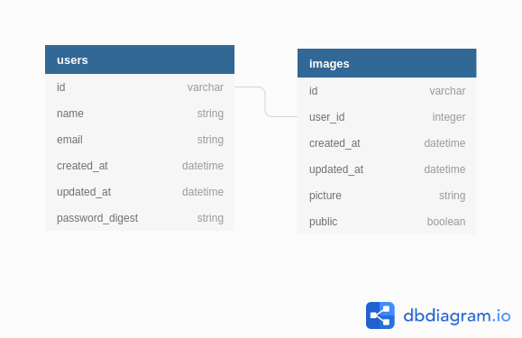

# Shopify Back-end Developer Challenge

  

Chosen feature(s): -

ADD image(s) to the repository
- one / bulk / enormous amount of images
- private or public (permissions)
- secure uploading and stored images

Tech Stack:
- Rails - Full Stack
- RSpecs - Testing

# Table of Contents

 - [Setup Instructions](#setup-instructions)
 - [Usage Instructions](#usage-instructions)
 - [Unit Tests](#running-unit-tests)
 - [How it Works](#how-it-works)

# Local Setup, Tests & Instructions

## Prerequisites

- Ruby 2.6.3
- Rails 5.2.5
- Bundler (rails package manager) `gem install bundler`
- SQL Lite 3
- Image Magick Package (Image resizing)

Download Instructions for image magick:

- Mac OS: `brew install imagemagick`
- Ubuntu 20.0.4: `sudo apt install imagemagick`

## Setup Instructions

1.  `cd image_repository`
2.  `bundle update`
3.  `bundle install`
4.  `rails db:migrate`
5.  `rails db:seed`

Finally run `rails s` and view the UI on [localhost:3000](http://localhost:3000/)

## Usage Instructions

- Hyperlinks to all pages on top of the UI
-  `Login Now!`: email `a@a.a`with password: `foobar` - Dummy user created during seed run
- Try to upload multiple image files - Only jpg, png extensions allowed - No other files
- Make your files public/private after you upload them and go to the [View all Images Link](http://localhost:3000/) to view public images anytime
- After uploading, you can click on the buttons to `Make your image public/private`and to make sure this worked you can just [view all Images](http://localhost:3000/)

#### DISCLAIMER/NOTES

- Since I focused on image uploading feature, I added a **DUMMY** user model to mimic private/public permissions on images.
- INFACT you can only login one user at a time on this prototype - THERE ARE NO **Sessions/Cookies** or proper **user authentication**

*Reasoning*: I tried to keep my focus towards secure image upload and chosen features rather than implementing a production grade user auth system which takes up a lot of unnecessary time.

## Running Unit Tests

-  `rails db:test:prepare`
-  `cd image_repository && rspec .`

### Overview of tests

- All tests reside in `image_spec.rb`
- ENDPOINT 1: `/image_view` - API for changing image to private/public
- ENDPOINT 2: `images_path` - API for uploading multiple images and associating them with the user

1. Tests 1 - 4 in `image_spec.rb`make sure that a non user is not able to update other user(s) image publicity and makes sure correct images are made public/private
2. Tests 5 - 7: Make sure that malicious files are **NOT** uploaded to the server and only images are uploaded

**NOTE**: I did not test the user sign in because that part is acting as a **DUMMY** only and was not in my chosen feature to implement for this image repository challenge

# How it works

## Database Schema

## Explanation  

- I make use of `carrierwave` gen to handle the individual file upload and have it connected to the `picture`attribute in the `Image` rails model
- Missing from DB Schema is rails association between `User`and `Image` : I set users to have many `Images`and added a boolean attribute `public`to determine if the specified image should be displayed publicly

### Bulk Uploading

- In the upload endpoint, I loop through the received files from `form input file fields`and call `carrierwave gem`up loader to handle everything else

### Secure Upload

- I modified the carrier Wave Gem file to include whitelist extensions to make sure malicious files are not uploaded which essentially acts as back end server validation
- I also added front-end whitelisting to `jpg/png`file extensions

### Private Public Images

- The `public`boolean attribute in db schema acts as a way to display images which only have this attribute set to `true`